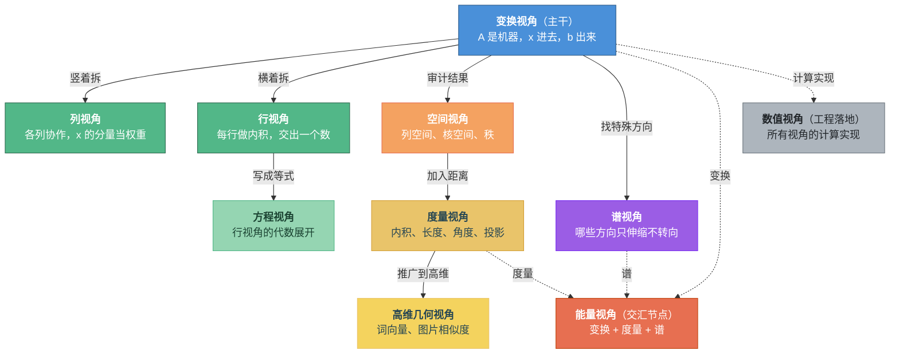

# 第十九章：全景——线性代数到底在研究谁

> 走了十八章，是时候停下来，回头看看整片风景了。

---

## 先把答案说清楚

走了十八章，我们讲了方程、行列式、矩阵、向量、空间、变换、分解、应用……概念一个接一个蹦出来，有时候你大概会觉得自己像是在森林里赶路——每棵树都看了，但整片森林长什么样？

是时候把地图摊开了。

线性代数到底在研究什么？一句话：**向量空间之间的线性变换**。而线性变换之所以能被矩阵完整记录，是因为它有一个关键性质：**变换只换轴，不换份数**——输入是几份 $\mathbf{e}_1$ 加几份 $\mathbf{e}_2$，输出就是同样份数的 $\mathbf{a}_1$ 加 $\mathbf{a}_2$。只要知道每根轴被送到了哪里，所有向量的命运就自动确定了。变换是主角，线性组合是主角的工作原理。

展开一点说，这条主轴是三段式的：

$$V \xrightarrow{\ T\ } W$$

$V$ 是出发的向量空间——舞台。$T$ 是线性变换——舞台上发生的动作。$W$ 是到达的向量空间——动作的结果落在哪里，$V$和$W$可以是同一个向量空间，也可以是不同的。

矩阵呢？矩阵是你选好了基（也就是坐标系）之后，把变换 $T$ 的动作用数字记录下来的那张表。变换是本体，矩阵是它在坐标系下的数字记录——每一列记录了对应坐标轴被送到了哪里。换一组基，同一个变换会写成不同的矩阵——但变换本身没有变，所以那些不依赖坐标选择的量（秩、行列式、特征值）才格外重要：它们是变换的真正指纹，不随基的改变而改变。

这里再强调一下向量和坐标的关系。向量是一个抽象的对象——它在向量空间里有自己的"位置"，但没有固定的坐标表示。坐标表示是你选了基之后才有的——在不同的基下，同一个向量会有不同的坐标。**向量是抽象的，坐标是具体的**——坐标只是向量在某个基下的数字化描述。在实际计算中，一旦选定了基，我们就把向量等同于它的坐标——n维空间中的一个点；如果在有内积的空间里把向量想象成一个箭头，那这个箭头的起点是原点，终点就是坐标所对应的那个点。向量的坐标就是这个点在基向量上的投影长度，也是基向量的权重。

既然矩阵是标准基坐标系下的坐标表示，矩阵的每一列记录了对应标准基向量被变换送到的位置——满秩时这些位置构成新基，不满秩时则发生塌缩。这一点在下文列视角后的**标准基被送到哪里了？**展开说。

而我们最熟悉的 $A\mathbf{x} = \mathbf{b}$，只是这条主轴在坐标里的最常见写法。这个式子里有三个角色，全章都围着它们转：

- $\mathbf{x}$ — **输入**。它是变换的出发点，携带了你要加工的信息。
- $A$ — **变换**。它是机器，决定了输入怎么被搬运、拉伸、旋转或压扁。
- $\mathbf{b}$ — **输出**。它是变换作用于输入之后的结果。

线性代数的核心叙事（本书以这个视角为主来梳理）：**输入 $\mathbf{x}$ 经过变换 $A$，产生输出 $\mathbf{b}$。** 十八章的内容，归根结底是围着这条主轴，从不同角度、不同深度去观察、去提问、去拆解。

有一个容易混淆的地方要提前说清：**输入角色不等于已知量。** 在"正向问题"里，$\mathbf{x}$ 已知、求 $\mathbf{b}$——直接算 $A\mathbf{x}$ 就行。但线性代数更常遇到的是"反向问题"：$A$ 和 $\mathbf{b}$ 已知，求 $\mathbf{x}$——已知输出和机器，反推输入。$\mathbf{x}$ 始终是输入角色，不管它是已知的还是待求的。

概念很多——向量空间、线性变换、矩阵、行向量、列向量——但它们全都可以用"输入→变换→输出"这条线串起来。接下来就沿着这条线，看看不同的视角各自在说什么。

**记住，把向量看成坐标表示，是默认了有了基，一般总会想象成是标准基，就按这个思路走下去，x是标准基下的坐标点，A是标准基下的变换矩阵，A记录了每个轴怎么变换，b是x经过变换后标准基下的新坐标，下面会反复强调**

---

## 一个式子，五种读法，统一到变换视角

线性代数的经典公式表达是$A\mathbf{x} = \mathbf{b}$，用一个具体的例子来演示。

设 $A = \begin{pmatrix} 2 & 1 & 0 \\ 0 & 3 & 1 \\ 1 & -1 & 2 \end{pmatrix}$，$\mathbf{b} = \begin{pmatrix} 8 \\ 7 \\ 3 \end{pmatrix}$。这里 $\det(A) = 15 \neq 0$，所以方程 $A\mathbf{x} = \mathbf{b}$ 有唯一解。

同一道题，你可以戴上五副不同的眼镜来看。每副眼镜下，输入 $\mathbf{x}$、变换 $A$、输出 $\mathbf{b}$ 这三个角色都在，只是你关注的重点不同。

**变换视角——整体看。** 矩阵 $A$ 是一个变换——它把三维空间中的每个点搬到新位置。$\mathbf{x}$（输入）整体进去，$\mathbf{b}$（输出）整体出来。$A\mathbf{x} = \mathbf{b}$ 是在问：哪个输入经过这次搬运后落在了 $(8, 7, 3)$ 的位置？因为 $A$ 可逆（行列式不为零），这次搬运没有把空间压扁，所以每个输出恰好对应唯一一个输入。

**列视角——拆开变换看内部通道。** 输入 $\mathbf{x}$ 本来就是三个标准方向的分量组合：$\mathbf{x} = x_1\mathbf{e}_1 + x_2\mathbf{e}_2 + x_3\mathbf{e}_3$。线性变换的规矩允许你把它拆开算：

$$A\mathbf{x} = x_1 \underbrace{A\mathbf{e}_1}_{\text{第1列}} + x_2 \underbrace{A\mathbf{e}_2}_{\text{第2列}} + x_3 \underbrace{A\mathbf{e}_3}_{\text{第3列}} = x_1 \begin{pmatrix} 2 \\ 0 \\ 1 \end{pmatrix} + x_2 \begin{pmatrix} 1 \\ 3 \\ -1 \end{pmatrix} + x_3 \begin{pmatrix} 0 \\ 1 \\ 2 \end{pmatrix} = \begin{pmatrix} 8 \\ 7 \\ 3 \end{pmatrix}$$

$A$ 的第 $i$ 列不是新的输入——它是 $A$ 对第 $i$ 个标准方向的输出响应（只在第 $i$ 个通道输入 1、其余通道输入 0 时，变换吐出来的结果）。$\mathbf{x}$ 仍然是输入，只是从"一个整体向量"展开成了"各输入通道的幅值列表"。最终输出 $\mathbf{b}$，就是这些单位响应按 $\mathbf{x}$ 的幅值加权叠加。这件事之所以成立，靠的是线性性——各通道的效果可以按比例缩放再相加，互不干扰。如果你做过规划，这和 Jacobian 矩阵在工作点附近的逻辑一样：$J$ 的每列是"只微小改变第 $i$ 个控制量时轨迹的一阶变化"，真实的 $\Delta\mathbf{u}$ 同时动了多个量，一阶近似下效果就是逐列叠加。

**行视角——拆开输出看逐分量检测。** 列视角是拆输入通道，行视角是拆输出分量。$A$ 的每一行是一个"检测器"（一组权重），对输入 $\mathbf{x}$ 做内积，算出输出 $\mathbf{b}$ 的一个分量。三行三个检测器，各测各的，互不干扰。

**方程视角——行视角的代数展开。** 每个检测器的结果写成等式：

$$2x_1 + x_2 = 8, \quad 3x_2 + x_3 = 7, \quad x_1 - x_2 + 2x_3 = 3$$

三个未知数，三个方程，解出来就行。这是第一章就会的事情。

**行视角的几何画面。** 每个方程定义一个平面。三个平面如果不平行也不重合，就交在一个点上——那个点就是输入。二维的情形更好画：每个方程是一条直线，解是两条线的交点。维度升高了，画面从"线的交点"变成了"面的交点"，但道理完全一样。

**空间视角——审计变换的能力。** 不问"具体算出多少"，而是问"这台变换机器能覆盖多大范围"。$A$ 是一个 $3 \times 3$ 满秩矩阵，它的三个列向量线性无关（三个单位响应不共面），所以输出能覆盖整个 $\mathbb{R}^3$。$\mathbf{b}$ 是 $\mathbb{R}^3$ 里的一个向量——它当然在覆盖范围内。在覆盖范围内的输出，就一定能找到对应的输入；满秩，就一定只有一个。

**回到矩阵本身：标准基被送到哪里了？**

五种视角聊完了，在串结构之前，值得停下来追问一个根本问题：矩阵 $A$ 里那些数字到底记录了什么？

答案就藏在列视角里。$A$ 的第 $i$ 列 $= A\mathbf{e}_i$——它是第 $i$ 个标准基向量经过变换后被送到的位置，而且这个位置仍然用标准基的坐标来描述。所以你可以把矩阵想象成在"挪动"标准基：第一列告诉你 $x$ 轴方向的标准基被送到哪里，第二列告诉你 $y$ 轴方向的被送到哪里，第三列告诉你 $z$ 轴方向的被送到哪里。**矩阵之所以是变换，就是因为它记录了坐标轴的去向——坐标轴的去向定义了整个空间的搬运规则。** 这里有一个关键，搬运规则的数值还是在搬运前的标准基上定义出来的。

如果这些新位置线性无关——三根新坐标轴不共面——它们就构成一组合法的新基，变换可逆，空间只是被重新摆放了。如果新位置塌缩了——比如三根轴挤到了一个平面甚至一条线上——那就是变换把空间压扁了，不可逆，有些输入被碾成了零。这就是满秩和不满秩的几何差别。

**打开变换的内部机制**

前面五种视角都是从外面观察变换——点怎么动、方程怎么列、空间覆盖多大。现在打开机器看一眼内部：为什么只知道基向量怎么动，就能知道**所有**向量怎么动？

答案是线性变换的核心性质：**变换只换轴，不换份数。** 输入是几份 $\mathbf{e}_1$ 加几份 $\mathbf{e}_2$，输出就是同样份数的 $\mathbf{a}_1$ 加 $\mathbf{a}_2$。用一个 $2 \times 2$ 的例子来看。设 $A = \begin{pmatrix}2&1\\0&1\end{pmatrix}$，它的两列 $\mathbf{a}_1 = (2,0)$，$\mathbf{a}_2 = (1,1)$ 告诉我们 $\mathbf{e}_1$ 被搬到了哪里、$\mathbf{e}_2$ 被搬到了哪里。

输入向量 $(3,2)$ 在标准坐标里就是 $3\mathbf{e}_1 + 2\mathbf{e}_2$。变换不会把"3"和"2"这两个权重乱改掉——它做的事是：保留权重，把原来的轴 $\mathbf{e}_1, \mathbf{e}_2$ 换成变换后的轴 $\mathbf{a}_1, \mathbf{a}_2$。所以输出就是：

$$A\mathbf{x} = 3\mathbf{a}_1 + 2\mathbf{a}_2 = 3\begin{pmatrix}2\\0\end{pmatrix} + 2\begin{pmatrix}1\\1\end{pmatrix} = \begin{pmatrix}8\\2\end{pmatrix}$$

这就是矩阵乘法为什么长成那个样子。$A\mathbf{x}$ 不是一串神秘的行列运算——它就是拿 $\mathbf{x}$ 的分量当权重，去线性组合 $A$ 的列。**线性组合是变换的内部发动机。**

**变换和坐标转换：同一个发动机的两个用途**

这个机制解释了为什么同一个算式能同时处理变换和坐标转换。

如果我们说 $A$ 是一个变换——标准坐标 $(3,2)$ 表示原来的点 $3\mathbf{e}_1 + 2\mathbf{e}_2$。经过变换，标准轴被搬成了 $\mathbf{a}_1, \mathbf{a}_2$，这个点被搬到 $3\mathbf{a}_1 + 2\mathbf{a}_2 = (8,2)$。点从标准位置 $(3,2)$ 来到了标准位置 $(8,2)$。

但如果一开始说的是：某个点在新基 $\mathbf{a}_1, \mathbf{a}_2$ 下的坐标是 $(3,2)$——那这句话的意思就是"这个点等于 $3\mathbf{a}_1 + 2\mathbf{a}_2$"。算出来还是 $3\mathbf{a}_1 + 2\mathbf{a}_2 = (8,2)$——这时 $(8,2)$ 就是它在标准坐标系里的位置。

注意，算式完全一样，不是因为矩阵突然有了另一套意思，而是因为两个问题本来就需要同一个动作：**权重乘以列向量，再求和**。矩阵的列是一组可供组合的轴，输入的数字是组合这些轴的权重。变换问题和坐标转换问题都在做这件事——只是权重的来源不同：一个来自标准基坐标，一个来自新基坐标。

**方向为什么"反了"？**

$A$ 把标准轴搬到新轴——好像方向是"标准→新"。但 $A\mathbf{c} = P$ 做的却是把新基坐标变成标准坐标——方向好像是"新→标准"。这并不矛盾。$A$ 搬的是轴，不是坐标。它先把标准轴搬成新轴；而一旦这些新轴写进了矩阵的列里，你把 $(3,2)$ 喂给它，这两个数字就被当成"沿着新轴走多少"的权重。$A$ 用搬完之后的轴做线性组合，组合出来的结果自然是标准坐标。**轴正着搬（标准→新），坐标反着算（新→标准），因为你组合的正是搬完之后的轴。**

**反过来呢？标准坐标转新基坐标**

已知一个点的标准坐标是 $(8,2)$，想知道它在新基下的坐标，就是问：哪组权重 $c_1, c_2$ 能让 $c_1\mathbf{a}_1 + c_2\mathbf{a}_2 = (8,2)$？也就是解方程：

$$A\mathbf{c} = \begin{pmatrix}8\\2\end{pmatrix}, \quad \mathbf{c} = A^{-1}\begin{pmatrix}8\\2\end{pmatrix} = \begin{pmatrix}3\\2\end{pmatrix}$$

这正是全书一开始就在做的事：已知输出，反过来找输入。$A$ 负责把权重组合成标准位置，$A^{-1}$ 负责从标准位置拆回权重。从头到尾主角都是变换，而变换的内部发动机，就是线性组合。知道这一层，对后面理解相似矩阵（$P^{-1}AP$）和对角化会有帮助——它们本质上都在做同一件事：换一组轴，用新轴的权重来描述同一个变换。

那非方阵呢？输入空间和输出空间维度不同，"搬家"的画面要调整。用具体数字来看。

**矮胖矩阵（$m < n$）——降维，信息必然丢失。**

$$A = \begin{pmatrix} 1 & 0 & 1 \\ 0 & 1 & 1 \end{pmatrix}, \quad \text{从 } \mathbb{R}^3 \text{ 到 } \mathbb{R}^2$$

三个标准基被送到哪里？

$$\mathbf{e}_1 \mapsto \begin{pmatrix}1\\0\end{pmatrix}, \quad \mathbf{e}_2 \mapsto \begin{pmatrix}0\\1\end{pmatrix}, \quad \mathbf{e}_3 \mapsto \begin{pmatrix}1\\1\end{pmatrix}$$

三根轴要挤进二维平面。但二维平面最多容纳 2 个独立方向，第三根轴的落点 $(1,1)$ 恰好等于前两根的落点之和——它没有带来新的方向。更要命的是，输入 $(1, 1, -1)$ 直接被压成了零：

$$1\begin{pmatrix}1\\0\end{pmatrix} + 1\begin{pmatrix}0\\1\end{pmatrix} + (-1)\begin{pmatrix}1\\1\end{pmatrix} = \begin{pmatrix}0\\0\end{pmatrix}$$

这意味着 $\mathbf{x}$ 和 $\mathbf{x} + (1,1,-1)$ 永远产生相同的输出——不同的输入，同一个输出，信息丢了。$2$ 维空间放不下 $3$ 个独立方向，降维必然有损。

**高瘦矩阵（$m > n$）——嵌入，满列秩时信息不丢。**

$$A = \begin{pmatrix} 1 & 0 \\ 0 & 1 \\ 1 & 1 \end{pmatrix}, \quad \text{从 } \mathbb{R}^2 \text{ 到 } \mathbb{R}^3$$

两个标准基被送到哪里？

$$\mathbf{e}_1 \mapsto \begin{pmatrix}1\\0\\1\end{pmatrix}, \quad \mathbf{e}_2 \mapsto \begin{pmatrix}0\\1\\1\end{pmatrix}$$

两根轴到了三维空间，而且它们不共线（不成比例），所以没有方向被压扁，信息完整保留。但两根轴只能撑起三维空间里的一个平面——有些输出是到不了的。比如 $\mathbf{b} = (0, 0, 1)$：

$$x_1\begin{pmatrix}1\\0\\1\end{pmatrix} + x_2\begin{pmatrix}0\\1\\1\end{pmatrix} = \begin{pmatrix}0\\0\\1\end{pmatrix} \implies x_1 = 0,\ x_2 = 0,\ \text{但 } x_1 + x_2 = 1$$

前两个分量要求 $x_1 = 0$、$x_2 = 0$，但第三个分量要求 $x_1 + x_2 = 1$——矛盾，无解。$(0,0,1)$ 不在那个平面上，变换够不着它。信息没丢，但覆盖不全。

一句话统一：**任何 $m \times n$ 矩阵，都记录了 $n$ 维输入空间的 $n$ 个标准基向量在 $m$ 维输出空间中的像。** 方阵时两个空间维度相同，可逆则是搬家，不可逆则是压扁。矮胖矩阵是降维，信息必然丢失（核非零）。高瘦矩阵是嵌入，满列秩时信息保全但输出只覆盖一个子空间（像不是全空间）。非方阵没有行列式和特征值——这些概念属于方阵，也就是从一个空间到自身的变换。

---

五种不是五个理论，是五副眼镜看同一件事。但它们也不是散装的五副——它们之间有清晰的结构关系。

**变换视角是主干。** 输入 $\mathbf{x}$ 进去，经过变换 $A$，输出 $\mathbf{b}$ 出来。这是最整体的视角，其余四种都可以从它出发理解。

**列视角和行视角是打开变换黑箱的两种方式。** 列视角从输入端拆：把输入 $\mathbf{x}$ 展开成各通道幅值，看输出 $\mathbf{b}$ 怎么由各通道的单位响应叠加而成。行视角从输出端拆：看输出 $\mathbf{b}$ 的每个分量是怎么从输入 $\mathbf{x}$ 中分别读出来的。整体看是"输入→变换→输出"，那这个变换具体是怎么变换的呢，行列视角就是变换的具体运行，解释了变换的具体运算细节，拆开看是"各通道叠加"或"逐分量检测"——是同一台机器的两种内部视图。所以列向量视角成了矩阵的主要计算视角，老师们也会经常说矩阵常按列向量看。

**方程视角是行视角的代数展开。** 每一行和 $\mathbf{x}$ 做内积等于 $b_i$，写出来就是一个方程。$n$ 行就是 $n$ 个方程。所以方程组不是独立于矩阵的东西——它就是行视角用等号写下来的样子。行视角再加上几何画面（每个方程画成一条线或一个平面，解是交点），就是你在中学画过的那种图。

**在本书以变换为主线的叙事里，空间视角像是对变换结果的"事后审计"。** 变换视角关心"机器怎么搬"，空间视角关心"搬完之后的格局"——输出覆盖了多大范围（列空间），什么输入被压成了零（核空间），保留了多少维度的信息（秩）。当然，子空间、维数、基这些概念本身并不依赖某个具体变换——它们是向量空间自带的结构语言。

还有一点值得强调：**五种视角对任何矩阵都能用，不要求满秩。** 有的例子碰巧是满秩的，所以答案特别简单——唯一解、线交于一点、$\mathbf{b}$ 一定拼得出来、变换可逆、列空间覆盖全部。但如果矩阵不满秩，五副眼镜依然能戴，只是看到的风景更复杂：方程组可能无解或有无穷多解，直线可能平行或重合，$\mathbf{b}$ 可能拼不出来（不在列空间里），变换把空间压扁了（不可逆），核空间不再只有零向量。**不满秩不是视角失效——恰恰是视角最能发挥价值的时候**，因为你需要多个角度才能看清发生了什么。

同一个 $A\mathbf{x} = \mathbf{b}$，你戴上哪副眼镜，看到的风景就不同。初学的时候你可能只有一副，学到后来手里有了五副，拿起哪副取决于当下哪个角度最趁手。

既然五种视角看的是同一件事，那"可逆"这个判断也应该在每副眼镜下都能说出来。对 $n \times n$ 方阵 $A$，以下说法全是同一句话的不同翻译：

| 视角 | $A$ 可逆意味着 |
|------|--------------|
| 方程 | $A\mathbf{x} = \mathbf{b}$ 对任意 $\mathbf{b}$ 有唯一解 |
| 行 | 约束不冗余也不矛盾，超平面恰好交于一点 |
| 列 | 列向量线性无关，能拼出任何 $\mathbf{b}$ |
| 变换 | 没有压扁任何方向，可以原路返回 |
| 空间 | 列空间 $=$ 整个 $\mathbb{R}^n$，核只有零向量，$\text{rank}(A) = n$ |
| 行列式 | $\det(A) \neq 0$ |

六种说法，全等价。任何一条成立，其余五条自动成立；任何一条不成立，全部一起垮掉。这就是为什么"可逆性"是线性代数里最重要的分界线——它是所有视角同时翻转的开关。附带一提，维数定理 $\dim V = \text{rank}(A) + \text{nullity}(A)$ 把"保留了多少"和"丢失了多少"拴在一起：秩越高，核越小，变换越接近可逆。

而这还只是 $A\mathbf{x} = \mathbf{b}$ 有唯一解的情况。真实问题往往不这么乖——方程无解、变换不可逆、数据有噪声、维度高到画不出图。每碰到一种新的困难，就需要给变换这台机器加装新的检测仪器。这些仪器就是更多的视角：

- **度量视角**：$\mathbf{b}$ 不在列空间里（无解），那列空间里离 $\mathbf{b}$ 最近的点在哪？——这是第十章正交投影和最小二乘的故事。
- **谱视角**：这个变换有没有哪些方向是"不变的"，只做伸缩？——这是第十一章特征值的故事。
- **能量视角**：$\mathbf{x}^\top A \mathbf{x}$ 是正是负，能告诉你曲面在某个点是碗状还是鞍状——这是第十二章二次型的故事。
- **数值视角**：解算得快不快、稳不稳、误差大不大？——这是第十四章计算革命的故事。
- **高维几何视角**：当"万物皆向量"之后，向量之间怎么比较远近和相似度？——这是第十八章的故事。

这些延伸视角不是凭空冒出来的，每一个都是某种基本视角碰壁之后的"升级补丁"：

**度量视角从空间视角长出来。** 空间视角告诉你"$\mathbf{b}$ 不在列空间里，无解"。故事到这里本来就结束了。但真实世界不接受"无解"这个回答——数据有噪声，你不可能刚好落在列空间里。于是你追问：既然到不了 $\mathbf{b}$，列空间里离它最近的点在哪？要回答"最近"，就必须引入距离和角度——也就是内积。空间视角只管"在不在里面"，加了度量之后才能回答"离多远"。

**谱视角从变换视角长出来。** 变换视角告诉你"$A$ 把空间搬了"，但没说搬得有多复杂。有没有哪些方向是"搬了等于没搬"的——方向不变，只被拉伸？如果有，那这些方向就是变换的"天然坐标轴"，沿着它们看，变换的行为最简单。这就是特征值和特征向量：不是在解 $A\mathbf{x} = \mathbf{b}$，而是在问 $A\mathbf{x} = \lambda\mathbf{x}$——变换在哪些方向上退化成了纯缩放。

**能量视角处于变换、度量和谱三者的交汇处。** $\mathbf{x}^\top A\mathbf{x} = \langle \mathbf{x}, A\mathbf{x} \rangle$——它把"一个向量经过变换后，与自己如何相互作用"压缩成一个标量。不再问"向量被搬到哪了"，而是问"这个方向上，变换的综合强度是正是负、是大是小"。正定意味着每个方向都是正的（碗状），有负的意味着某些方向塌下去了（鞍状）。当 $A$ 是对称矩阵时，能量视角和谱视角尤其紧密：二次型的正负性完全由特征值决定，主轴方向就是特征向量方向。这在优化和物理里特别关键：极小值点要求正定，能量函数要求有下界。

**数值视角是所有视角的工程落地。** 前面所有视角回答的都是"是什么"的问题，数值视角回答"怎么算"——用什么分解、精度够不够、哪一步会放大误差。理论上能解的方程，计算机上未必算得稳；理论上等价的两种算法，数值稳定性可能天差地别。

**高维几何视角是度量视角的应用推广。** 一旦你有了内积和距离，就可以把它用到任何能表示成向量的东西上——词、图片、用户行为。两个词向量的夹角余弦就是它们的语义相似度。这不是新理论，是度量视角从低维几何搬到了高维数据的世界。

把上面所有视角的关系画成一张图（实线是叙事主线，虚线表示概念交汇）：

眼镜越多，看到的越丰富。但归根结底，看的还是同一件事：向量空间、线性变换，以及它们在坐标里的化身——矩阵。

上面说的是同一个矩阵在同一时刻的多种读法——横向的。接下来换一个方向：这些读法不是凭空出现的，它们是线性代数在解决越来越难的问题时，一层层长出来的。

---

## 研究重心的三次升级

这些眼镜不是同时出现的。如果你回顾整本书，会发现研究的重心经历了三次升级，每次升级，提问的层次都不一样。

**第一层：已知变换和输出，反找输入。**

在最典型的场景下，变换 $A$ 和目标输出 $\mathbf{b}$ 是已知的，要求的是输入 $\mathbf{x}$。这是最原始的问题，也是人类最先问出来的问题。巴比伦人在泥板上算两元一次方程的时候，关心的就是这件事。第一章到第三章——方程的起源、消元术、行列式——全部围绕这个目标：怎么把答案算出来。

打个比方：你有一台机器（$A$），有一个想要的成品（$\mathbf{b}$），你想知道该喂进什么原料（$\mathbf{x}$）才能加工出这个成品。这一层关心的是"把活干了"。

**第二层：研究变换——什么输入会被丢掉？输出能覆盖多大？**

从第七章开始，问题升级了。我们不再满足于对着一组具体的输出 $\mathbf{b}$ 反找输入，而是开始好奇变换 $A$ 本身的特性：什么样的输入会被它压成零（送进核里）？它的输出能覆盖多大范围（像有多大）？如果目标输出不在覆盖范围内（$\mathbf{b}$ 不在列空间里），最近的可达输出是什么？

第七章到第十章的故事——线性变换的定义、核与像与秩、行列式的几何含义、正交投影与最小二乘——都在回答这一层的问题。注意，第十章虽然讲的是"无解时怎么办"，但它的核心仍然是在研究 $A$ 和 $\mathbf{b}$ 的关系：$\mathbf{b}$ 到不了列空间，那就找列空间里离 $\mathbf{b}$ 最近的输出。这仍然是"机器能对原料做什么"的问题。

**第三层：拆开变换机器——内部齿轮长什么样？**

到了第十一章，重心再次升级。我们不再只问"变换 $A$ 对输入做了什么"，而是开始拆开变换本身——看它的内部结构。

哪些方向在变换下只伸缩不旋转？（特征值与特征向量）对称矩阵能不能彻底拆成独立的伸缩？（对角化与谱定理）$\mathbf{x}^\top A \mathbf{x}$ 的正负号能告诉我们什么？（二次型与正定性）怎么把任意矩阵拆成旋转、伸缩、再旋转的三步组合？（SVD）

第十一章、第十二章、第十五章讲的都是这一层的事——把变换的内部齿轮一个一个卸下来看。而第十四章站在第三层和实践之间——它需要知道 $A$ 的结构（比如条件数依赖于特征值），但它真正关心的是怎么在有限精度的计算机上稳定地把这些分解算出来。

三层问题，可以用"输入→变换→输出"这条线来定位：第一层看这条线能不能跑通（找到输入）；第二层研究这台机器能做到什么、做不到什么（变换的能力边界）；第三层把机器拆开，看它为什么会这样（变换的内部结构）。从"反找输入"到"理解变换"到"拆解变换"——这就是研究重心的三次升级。

顺便说一句：第四章到第六章——矩阵的发明、向量的觉醒、向量空间——它们不属于上面哪一层，而是在搭建语言和舞台。没有"矩阵""向量""空间"这些概念，后面的三层问题根本提不出来。它们是地基，不是楼层。

---

## 视角是怎么一步步长出来的

前面我们问的是"一个矩阵能怎么看"；现在换个问题：这些看法为什么非要被发明出来？

第十三章讲了"公理化运动怎么把散落的概念统一起来"——那是一个历史故事。这里我想换一个角度：不看历史上谁先谁后，而看**逻辑上**每个视角是因为什么问题才被逼出来的。

这是一条十环链条，每一环都是前一环留下的问题催生的：

**方程** — 好几个未知数、好几个条件，怎么同时搞定？这是最原始的驱动力。

**行列式** — 方程多了，能不能不解就先判断有没有唯一解？于是出现了一个只跟系数有关的数值判据——对方阵来说，行列式为零就退化。

**矩阵** — 系数表总是反复出现，能不能把它当成一个整体来操作？于是系数表独立成了一个数学对象，有了自己的加法和乘法。

**向量** — 矩阵乘的那个东西（未知数列），它不只是一串数字——它有方向、有大小，能组合。它该有自己的名字和身份。

**向量空间** — 向量住在哪里？什么样的集合能让向量自由地做加法和数乘而不"跑出去"？公理化的舞台搭好了。

**线性变换** — 两个向量空间之间的关系是什么？能不能把"保持线性结构"的映射单独拎出来研究？于是矩阵获得了更深的身份：它是变换在坐标里的记录。线性变换在这条链条上登场较晚，但一旦登场，它就反过来统摄了前面的方程、行列式、矩阵、向量和向量空间——这就是为什么前面一节把它放在视角族谱的主干位置。

**内积** — 向量之间怎么量角度、量距离？"正交"是什么意思？"最近"是什么意思？有了度量，空间才有了几何。

**特征值** — 变换把空间搅来搅去，有没有哪些方向是"定海神针"——方向不变，只做伸缩？找到这些方向，变换的行为就一目了然了。

**分解** — 特征值只对方阵、而且不是所有方阵都管用。有没有一种对任意矩阵都成立的拆解方式？SVD 说：有，而且拆成三步——旋转、伸缩、再旋转。

**高维几何** — 当"万物皆向量"之后（词是向量，图像是向量，用户偏好是向量），几百维、几万维的空间里怎么比较远近、怎么找结构？高维几何的直觉和低维很不一样，需要重新训练。

十个环，一环扣一环。每个新视角的出现，都不是谁拍脑袋想出来的，而是前一个视角留下了它回答不了的问题，新视角就是那个问题的答案。

---

## 下一步

框架搭好了——主轴、视角、升级路径、十环链条——你手里已经有了一张完整的地图。

但地图只是骨架。接下来，我们要用这个框架回头审视那些具体的"零件"：七个核心式子各自回答什么问题？矩阵身上的各种运算——加、乘、转置、求逆、求行列式——在变换的语言里各自扮演什么角色？整个概念体系的网络结构长什么样？

带着地图，进入下一章。
