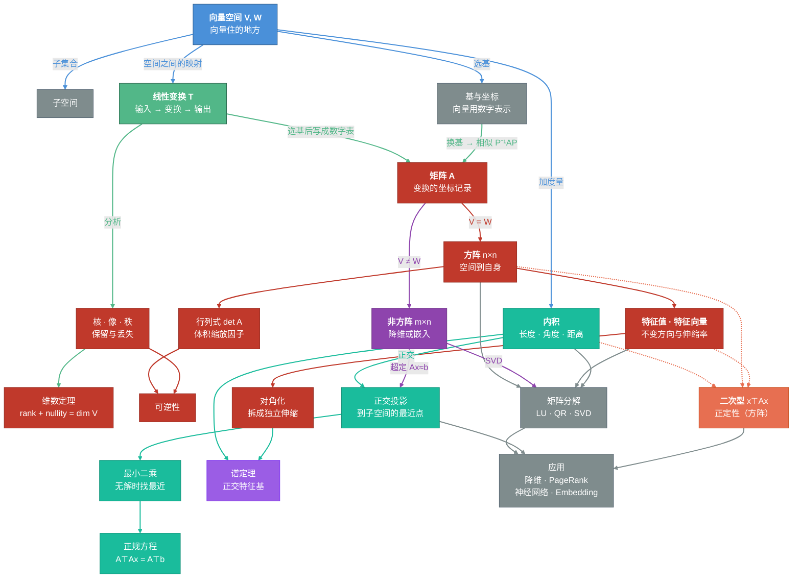

# 第二十章：重读——用变换的眼光回看运算与概念

> 有了地图，再看每棵树就不一样了。

---

## 从地图到零件

上一章搭好了线性代数的主轴——$V \xrightarrow{T} W$，建立了五种视角和五种延伸视角，梳理了研究重心的三次升级，追溯了十个概念如何一环扣一环地长出来。

那是骨架。这一章填血肉。

我们要做两件事。第一件：把这本书里反复出现的七个核心式子摆在一起，看它们各自在主轴上的位置。第二件：回头审视矩阵身上的各种运算——加、乘、转置、求逆、行列式、分块——用变换的语言重新理解它们。最后，把所有概念画成一张网络图，看看它们怎么咬合在一起。

---

## 七个核心式子的家族

这本书里来来回回出现了很多公式，但真正核心的、承载主线的，就那么几个。它们之间不是父子辈的传承关系，更像是一个大家族——有的是亲兄弟，有的是表亲，各有各的角色。

**1. $A\mathbf{x} = \mathbf{b}$ — 谁变换后等于 $\mathbf{b}$？**

最基本的问题：已知变换 $A$ 和输出 $\mathbf{b}$，反找输入 $\mathbf{x}$。整本书从这里出发。

**2. $AX = B$ — 同一个 $A$，批量处理。**

同一台变换机器 $A$，一次喂进一批输入。$X$ 的每一列是一个输入，$B$ 的每一列是对应的输出。也可以读成两个变换的复合——先做 $X$，再做 $A$，结果等同于变换 $B$。

**3. $A\mathbf{x} = \lambda\mathbf{x}$ — 谁方向不变，只伸缩？**

这里输出不再是一个给定的 $\mathbf{b}$，而是输入 $\mathbf{x}$ 自己的标量倍——变换之后方向没变，只是长度缩放了 $\lambda$ 倍。换句话说：有些特殊输入，经过变换后输出方向和输入完全一致。找到这些特殊方向（特征向量）和对应的缩放率（特征值），你就抓住了变换最本质的骨架。

**4. $A = \text{分解}$（LU / QR / $PDP^{-1}$ / SVD）— $A$ 的内部结构。**

与其把变换 $A$ 当成一个黑箱，不如把它拆成几台简单机器的串联。不同的分解方式对应不同的拆法：LU 是消元过程的记录，QR 把列向量正交化，$PDP^{-1}$ 沿特征方向拆成独立的伸缩，SVD 则对任意矩阵——不限方阵——做"旋转-伸缩-旋转"的三步分解。

**5. $\min_{\mathbf{x}} \|A\mathbf{x} - \mathbf{b}\|^2$ — 无解时，找最近的解。**

目标输出 $\mathbf{b}$ 不在变换的可达范围（列空间）里，没有任何输入能精确产生这个输出。那就退而求其次：在所有可能的输出 $A\mathbf{x}$ 里，找一个离 $\mathbf{b}$ 最近的。"最近"是用距离（范数的平方）来衡量的。这就是最小二乘。

**6. $A^\top A \mathbf{x} = A^\top \mathbf{b}$ — 正规方程。**

最小二乘问题的解满足这个方程。它的几何含义是：最优近似要求残差 $\mathbf{b} - A\mathbf{x}$ 与 $A$ 的列空间正交——也就是说，$A^\top(\mathbf{b} - A\mathbf{x}) = 0$，展开就是 $A^\top A\mathbf{x} = A^\top\mathbf{b}$。一个"近似"的问题，通过正交条件变成了一个"精确"的方程。

**7. $\mathbf{x}^\top A \mathbf{x}$ — 能量/曲率。**

这个式子和前面六个都不太一样——输出不是一个向量，而是一个标量。输入 $\mathbf{x}$ 先经过变换 $A$ 得到 $A\mathbf{x}$，然后再被 $\mathbf{x}^\top$ "读数"，压缩成一个数。这个标量衡量的是"$\mathbf{x}$ 方向上的能量"或"曲面在这个方向上的弯曲程度"。$A$ 对称正定时这个值恒正——碗状；有正有负时——鞍状。二次型就是围绕这个式子展开的。

七个式子，都围着"输入→变换→输出"这条线。前四个在做正向或反向运算，第五六个处理输出到不了目标的情况，第七个把输出从向量压成标量。它们共享同一个数学骨架，只是各自回应不同的问题。

---

## 运算：对变换的操作

七个核心式子是你能向变换**提的问题**。现在换一个角度：你能对变换本身做什么**操作**？

矩阵身上的运算不少——加、数乘、乘、转置、求逆、行列式、迹、分块、初等矩阵——在教材里它们通常是一条条代数规则。但如果你带着上一章的框架来看，每一条规则都有一个"变换层面的含义"。我们用上一章那个 $3 \times 3$ 矩阵 $A = \begin{pmatrix} 2 & 1 & 0 \\ 0 & 3 & 1 \\ 1 & -1 & 2 \end{pmatrix}$ 做贯穿示例，把它们统一过一遍。

### 组合：把变换拼在一起

**加法 $A + B$：两台机器，叠加效果。**

如果 $A$ 和 $B$ 都是从 $V$ 到 $W$ 的变换，那 $A + B$ 定义为：对同一个输入 $\mathbf{x}$，分别经过 $A$ 和 $B$，把两个输出加起来。

$$(A + B)\mathbf{x} = A\mathbf{x} + B\mathbf{x}$$

这要求 $A$ 和 $B$ 的尺寸完全相同——同样的输入空间、同样的输出空间——否则加法没有意义。方阵和非方阵都能加，只要尺寸对得上。

**数乘 $kA$：给整台机器的输出拧个音量旋钮。**

$$(kA)\mathbf{x} = k \cdot (A\mathbf{x})$$

每个输入经过变换后，输出统一放大 $k$ 倍。几何上，$2A$ 把所有东西拉伸两倍，$-A$ 把所有东西翻转。

数乘对行列式的影响值得注意：$\det(kA) = k^n \det(A)$，不是 $k \det(A)$——因为 $n$ 维空间里每个维度都被缩放 $k$ 倍，体积缩放了 $k^n$ 倍。这是很多人容易栽跟头的地方。

**乘法 $AB$：两台机器串联。**

$$(AB)\mathbf{x} = A(B\mathbf{x})$$

先过 $B$，再过 $A$。注意顺序：$AB$ 是"先 $B$ 后 $A$"，不是"先 $A$ 后 $B$"。这就是矩阵乘法不满足交换律的根源——先旋转再平移，和先平移再旋转，结果不一样。

非方阵也能相乘，只要维度接口对得上：$B$ 是 $p \times n$（从 $n$ 维到 $p$ 维），$A$ 是 $m \times p$（从 $p$ 维到 $m$ 维），串联后 $AB$ 是 $m \times n$（从 $n$ 维到 $m$ 维）。中间那个 $p$ 维——$B$ 的输出空间必须等于 $A$ 的输入空间——是两台机器的"接口"。接口不匹配，就没法串联。

### 反向与对调

**逆矩阵 $A^{-1}$：精确撤销。**

如果变换 $A$ 没有压扁任何方向（可逆），那存在一台反向机器 $A^{-1}$：先做 $A$ 再做 $A^{-1}$，回到原点。

$$A A^{-1} = A^{-1} A = I$$

$I$ 是恒等变换——什么都不动。

逆矩阵只对方阵有意义，而且只在 $\det A \neq 0$ 时存在。非方阵没有逆——一个 $3 \times 2$ 的矩阵把二维映射到三维，你没法精确地"反过来"走。但 SVD 提供了一个替代品：**伪逆** $A^+$——它给出"最近似的逆操作"，在最小二乘意义下最优。

**转置 $A^T$：映射方向掉头。**

$A$ 是从 $V$ 到 $W$ 的变换（$m \times n$），$A^T$ 是从 $W$ 到 $V$ 的映射（$n \times m$）——输入空间和输出空间对调了。

转置不是逆。逆是"原路精确返回"，转置是"方向对调"，走的未必是原路。两者什么时候重合？正交矩阵——$Q^T = Q^{-1}$——变换只做旋转和翻转，不做伸缩，所以"掉头"恰好等于"原路返回"。

转置对非方阵格外重要。$A$ 是 $m \times n$ 的，$A^T A$ 就是 $n \times n$ 的方阵，$A A^T$ 是 $m \times m$ 的方阵。这两个方阵分别捕获了变换在输入空间和输出空间的结构。正规方程 $A^T A \mathbf{x} = A^T \mathbf{b}$ 就是通过 $A^T$ 把一个非方阵问题变成了方阵问题——这是最小二乘法的核心。

### 标量指纹：从变换里提取一个数

**行列式 $\det A$：体积缩放因子。**

变换把单位超平行体的体积缩放了多少倍？答案就是行列式的绝对值。符号记录了手性是否翻转。

- $\det A \neq 0$：没有压扁，可逆。
- $\det A = 0$：至少一个维度被压成了零，不可逆。
- $\det(AB) = \det A \cdot \det B$：串联两台机器，体积缩放因子相乘。

行列式只对方阵有意义——非方阵的输入空间和输出空间维度不同，谈不上"体积缩放"。

**迹 $\text{tr}(A)$：对角线之和 = 特征值之和。**

迹是方阵对角线元素的和，也等于所有特征值的和。行列式告诉你体积缩放了多少，迹告诉你各方向的伸缩率加起来是多少。

迹有一条不太显然但很有用的性质：$\text{tr}(AB) = \text{tr}(BA)$——即使 $AB \neq BA$，它们的迹相等。甚至 $A$、$B$ 可以不是方阵：只要 $A$ 是 $m \times n$、$B$ 是 $n \times m$，$AB$ 是 $m \times m$，$BA$ 是 $n \times n$，它们的迹相等。这条性质在证明"相似矩阵有相同的迹"时一步到位。

### 拆与装

**分块矩阵：按子空间拆开看。**

把输入空间切成几块、输出空间也切成几块，对应的矩阵就被切成了一组"子矩阵"。分块乘法和标量乘法规则完全一样——把每个块当成一个"数"来算，只要接口对齐。

最有用的特殊情况是**块对角矩阵**：非对角块全是零，意味着子系统之间完全不耦合，大问题直接分裂成几个独立的小问题。对角化 $A = PDP^{-1}$ 可以看成终极的分块——$D$ 是对角矩阵，每个对角元素就是一个 $1 \times 1$ 的"块"，代表一个独立方向上的纯伸缩。

**初等矩阵：变换的最小构建单元。**

三种初等矩阵，对应三种最基本的行操作：

- **倍加**：把一行的若干倍加到另一行。长得像单位矩阵，只在一个位置多了一个数。
- **换行**：交换两行。是单位矩阵交换了两行。
- **倍乘**：把某一行乘以一个非零常数。是单位矩阵某个对角元素换成了那个常数。

每种初等矩阵都可逆——倍加的逆是"减回去"，换行的逆是"再换回来"，倍乘的逆是"除回去"。

任何可逆矩阵都可以分解为一串初等矩阵的乘积。这就是高斯消元法的矩阵语言：消元的每一步是一次初等行操作，对应左乘一个初等矩阵。整个消元过程——一连串初等矩阵的乘积——就是 LU 分解。

### 汇总：运算全景表

| 运算 | 对变换做了什么 | 方阵 | 非方阵 |
|------|------------|------|--------|
| $A + B$ | 叠加两台机器的效果 | ✓ | ✓（同尺寸） |
| $kA$ | 输出统一缩放 $k$ 倍 | ✓ | ✓ |
| $AB$ | 先 $B$ 后 $A$，串联 | ✓ | ✓（接口匹配） |
| $A^{-1}$ | 精确撤销 | ✓（可逆时） | ✗（用伪逆 $A^+$ 代替） |
| $A^T$ | 映射方向掉头 | ✓ | ✓（$m \times n \to n \times m$） |
| $\det A$ | 体积缩放因子 | ✓ | ✗ |
| $\text{tr}(A)$ | 特征值之和 | ✓ | ✗ |
| 分块 | 按子空间拆开 | ✓ | ✓ |
| 初等矩阵 | 变换的原子操作 | ✓ | ✓ |

最右两列画出了一条清晰的边界：**加法、数乘、乘法、转置、分块、初等矩阵**对所有矩阵通用；**逆、行列式、迹**是方阵的专属工具。这条边界不是人为规定的——它反映了一个根本事实：只有当输入空间和输出空间维度相同时，"精确撤销""体积缩放""对角线之和"这些概念才有意义。

---

## 概念网络与应用映射

### 核心概念网络

这十八章的概念很多，但真正撑起整个体系的，大约就十五个。它们之间的关系不是一条直线，而是一张网。下面用一张图把这张网画出来：

**连线颜色图例：**

| 颜色 | 含义 | 具体连了哪些节点 |
|------|------|----------------|
| **蓝色** | 空间结构 | 向量空间 → 子空间、基与坐标、内积、线性变换 |
| **绿色** | 变换路径 | 线性变换 → 矩阵、核像秩 → 维数定理；基与坐标 → 矩阵（换基/相似） |
| **棕红** | 方阵分支 | 矩阵 → 方阵 → 行列式 → 可逆性；方阵 → 特征值 → 对角化 |
| **紫色** | 非方阵分支 | 矩阵 → 非方阵；非方阵 → 正交投影（超定方程）；非方阵 → 矩阵分解（SVD） |
| **青色** | 度量分支（长度·角度·距离） | 内积 → 正交投影 → 最小二乘 → 正规方程；内积 → 谱定理 ← 对角化 |
| **红橙虚线** | 交汇概念 | 内积 ··→ 二次型 ←·· 方阵、特征值（三者交汇） |
| **灰色** | 分解与应用 | 方阵/非方阵/特征值/内积 → 矩阵分解 → 应用 |

**怎么读这张图：**

最上面是**向量空间**（蓝色节点）——一切的起点。蓝色线从它出发，搭建四样基础设施：子空间、基与坐标、内积、线性变换。

绿色线是**从抽象到具体的坐标化**：线性变换本身是抽象的，选了一组基之后写成数字表就是矩阵。同时，变换的保留与丢失由核、像、秩来刻画，维数定理把它们拴在一起。基与坐标也连到矩阵——换一组基，同一个变换写成不同的矩阵（相似 $P^{-1}AP$）。

矩阵往下分叉成**方阵**（棕红分支）和**非方阵**（紫色分支）。棕红线沿方阵走出行列式、可逆性、特征值、对角化——这些概念只对方阵有意义。紫色线沿非方阵走向最小二乘（超定方程 $A\mathbf{x} \approx \mathbf{b}$ 不要求方阵）和 SVD（对任意矩阵都适用的分解）。

青色线是**度量分支**（度量 = 测量长度、角度、距离）：向量空间本身没有"长几米""夹角多少度"的概念，内积给空间装上了这把尺子。有了内积之后，才有了正交投影、最小二乘、正规方程，以及谱定理（对称矩阵在正交基下对角化）。

红橙虚线标出**交汇概念**：二次型 $\mathbf{x}^\top A\mathbf{x}$ 同时需要内积、方阵和特征值三个概念才能完整理解——它站在三条分支的交叉路口。

灰色线是**下游枢纽**：矩阵分解（LU / QR / SVD）汇聚了方阵、非方阵、特征值和内积四条线，是计算工具的总集合。从分解和投影出发，最终连接到实际应用。

### 现代应用映射

这张概念网不只是理论上的自洽——它在今天的技术世界里到处都在运转。下面这张表把本书第三幕（第十四章到第十八章）讨论过的应用，映射回它们接入的核心概念：

| 应用领域 | 接入的核心概念 | 对应章节 |
|---------|--------------|---------|
| LU / QR 分解 | 消元法 → 矩阵分解 | ch14 |
| 条件数 | 矩阵 → 数值稳定性 | ch14 |
| SVD / PCA | 正交 + 特征值 → 低秩近似 | ch15 |
| PageRank | 特征向量 + 迭代法 | ch16 |
| 推荐系统 | 低秩矩阵分解 + 秩 | ch16 |
| 神经网络 | 线性变换 + 矩阵乘法 | ch17 |
| Embedding | 向量空间 + 内积 | ch18 |
| Attention | 矩阵乘法 + 内积（相似度） | ch18 |

你看，右边那一列从 ch14 到 ch18，整个第三幕的应用都能在概念网络里找到自己的位置。它们不是凭空冒出来的新东西——它们是老概念在新场景里的再一次登场。

不过你可能会问：在这些应用里，矩阵好像不总是在做"变换"。比如你有一堆用户的数据——每个人用身高、体重、年龄、消费金额这四个数来描述——那每个人就是四维空间 $\mathbb{R}^4$ 里的一个向量（列向量）。一千个用户？就是 $\mathbb{R}^4$ 里的一千个点。把它们一列列排起来，就得到一个 $4 \times 1000$ 的矩阵 $X$——每一列是一个人。

这个 $X$ 不是变换——它没有把谁搬到哪里去。它是一张**数据表**，记录了一片点云的坐标。

那变换藏在哪里？藏在后面。机器学习要学的是一个矩阵 $W$，让 $WX$ 尽量接近你想预测的结果 $Y$——比如"这个用户会不会买某个商品"。$W$ 才是那个真正的线性变换：它左乘每个用户的特征向量，把特征映射成预测结果，和我们熟悉的 $A\mathbf{x} = \mathbf{b}$ 完全同一个结构。$X$ 提供输入，$W$ 负责变换，角色各有分工，但说的还是同一套语言。其实同一个矩阵并没有固定身份——$X$ 在 $WX = Y$ 里是一批输入，换个场景写成 $X\mathbf{w} = \mathbf{y}$，它就成了变换本身。矩阵是什么，取决于你把它放在式子的哪个位置。

"放在哪个位置"还引出一条实用规则：**左乘操作行，右乘操作列。** $WX$ 是 $W$ 从左边乘 $X$——它重新组合 $X$ 的行（如果每列是一个人，行就是特征，所以左乘在变换特征）。$XS$ 是 $S$ 从右边乘 $X$——它重新组合 $X$ 的列（列是人，所以右乘在混合样本）。这不是一条新定理，而是第七章"横着拆、竖着拆"的操作版本：同一个乘法，从行归拢看到的是内积检测，从列归拢看到的是线性组合——放在左边还是右边，决定了你操作的是哪个方向。

---

## 交给终章

那些最初关于方程和未知数的问题，今天可以被写成 $V \xrightarrow{T} W$ 这条主轴。四千年来，一代代人把这条线索拓宽、加深、分叉，最终长成了你刚刚看到的这张网——概念相互咬合、视角彼此印证、应用遍地开花。

地图摊开了。但地图不是风景——接下来，我们该站到更高的地方，聊几句地图以外的事了。
